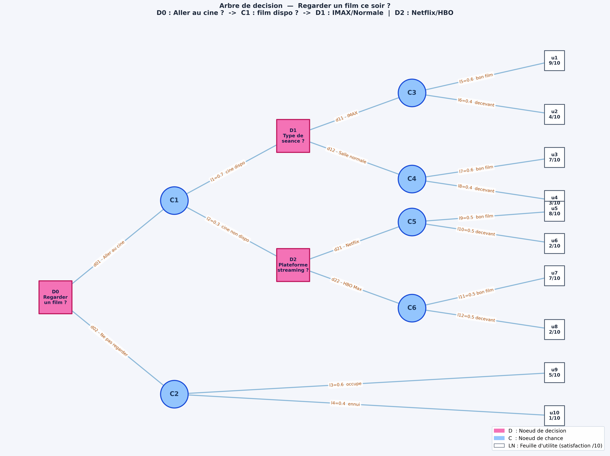

# 🎬 Decision Tree Suite — "Regarder un film ce soir ?"

> **Génération, visualisation et analyse stratégique d'un arbre de décision séquentiel avec NetworkX et Matplotlib.**

---

## 📸 Visualisation de l'Arbre

Voici le rendu de l'arbre de décision généré automatiquement et sauvegardé sous format haute résolution :

---

## 📌 Présentation du Projet

Ce projet modélise un problème de décision séquentielle à plusieurs niveaux sous incertitude : le choix du programme du soir ("Regarder un film ?"). 

L'arbre intègre trois typologies de nœuds distinctes :
* **Nœuds de Décision ($D$)** : Choix contrôlés par le décideur (*ex. Aller au cinéma vs Ne pas regarder*).
* **Nœuds de Chance ($C$)** : Événements stochastiques gouvernés par la nature (*ex. Disponibilité des séances, qualité du film*).
* **Feuilles d'Utilité ($LN$)** : Résultats finaux exprimés sous forme de score de satisfaction sur 10.

---

## ⚙️ Structure & Stratégies ($\delta$)

Une stratégie $\delta$ correspond à une règle de décision complète fixant un choix pour chaque nœud de décision rencontré dans l'arbre.

| Stratégie ($\delta$) | Choix $D_0$ | Choix $D_1$ (Cinéma) | Choix $D_2$ (Streaming) |
| :--- | :--- | :--- | :--- |
| **$d_1$** | $d_{01}$ (Aller au ciné) | $d_{11}$ (IMAX) | $d_{21}$ (Netflix) |
| **$d_2$** | $d_{01}$ (Aller au ciné) | $d_{11}$ (IMAX) | $d_{22}$ (HBO Max) |
| **$d_3$** | $d_{01}$ (Aller au ciné) | $d_{12}$ (Salle normale) | $d_{21}$ (Netflix) |
| **$d_4$** | $d_{01}$ (Aller au ciné) | $d_{12}$ (Salle normale) | $d_{22}$ (HBO Max) |
| **$d_5$** | $d_{02}$ (Ne pas regarder) | — | — |

### Formalisation ensembliste
* **$d_1$** = $\{ (D_0, C_1) \,;\, (D_1, C_3) \,;\, (D_2, C_5) \}$ $\rightarrow$ *Cinéma IMAX, puis Netflix si indisponible.*
* **$d_2$** = $\{ (D_0, C_1) \,;\, (D_1, C_3) \,;\, (D_2, C_6) \}$ $\rightarrow$ *Cinéma IMAX, puis HBO Max si indisponible.*
* **$d_3$** = $\{ (D_0, C_1) \,;\, (D_1, C_4) \,;\, (D_2, C_5) \}$ $\rightarrow$ *Cinéma Salle Normale, puis Netflix si indisponible.*
* **$d_4$** = $\{ (D_0, C_1) \,;\, (D_1, C_4) \,;\, (D_2, C_6) \}$ $\rightarrow$ *Cinéma Salle Normale, puis HBO Max si indisponible.*
* **$d_5$** = $\{ (D_0, C_2) \}$ $\rightarrow$ *Ne pas regarder de film.*

---
